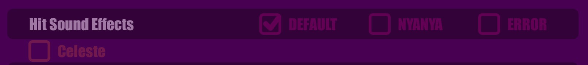

# CustomHitSound

Allows you to use custom hit sounds in game.

[中文Readme](README.zh.md)

## How to Install
Install [Muse Dash Mod tools](https://github.com/MDModsDev/MuseDashModToolsUI/releases/latest), follow the instructions and install the mod.

Then, download BattleSfx.zip from [Releases](https://github.com/MDModsDev/CustomHitSound/releases/latest), extract it into `Muse Dash\UserData` folder.

The path should be `Muse Dash\UserData\BattleSfx`.

## How to use the Hit Sound Pack
There should be in game toggles in the Audio Setting, under the Hit Sound Effects



Select the toggle to use the sound effect.

## How to Create your own Hit Sound
There is a default template in BattleSfx.zip (The Celeste folder).

#### There are various hit sounds you can replace:

```
char_common_empty_atk
char_common_empty_jump
sfx_hp
sfx_score
sfx_press_top
sfx_jump
sfx_mezzo_1
sfx_forte_2
sfx_piano_2
sfx_forte_3
sfx_mezzo_3
sfx_ghost_gc
hitsound_000
hitsound_001
hitsound_002
hitsound_003
hitsound_004
hitsound_005
hitsound_006
hitsound_007
hitsound_008
hitsound_009
hitsound_010
hitsound_011
hitsound_012
hitsound_013
hitsound_014
hitsound_015
```

#### And for the sound names, you can refer to the following table:

```
sfx_forte_2 = large2, boss rush
sfx_forte_3 = hammer
sfx_mezzo_1 = small, medium, gemini, boss note
sfx_mezzo_3 = ghost
sfx_piano_2 = assault, large1
sfx_hp = heart
sfx_score = blue collectable note
sfx_press_top = long press
sfx_ghost_gc = gc scene ghost
hitsound = masher 
```

#### For naming style
**You should name the audio file with the following format:**

soundname_<folder name in lowercase>.wav (or other audio format)

For example: sfx_forte_2_celeste.wav in Celeste folder.

### The game will use the default sound if you don't implement the sound.