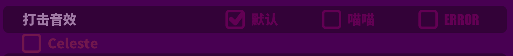

# CustomHitSound

玩家可以自制音效包替换游戏内打击音效

## 如何安装
安装 [Muse Dash Mod tools](https://github.com/MDModsDev/MuseDashModToolsUI/releases/latest), 跟着提示的流程安装mod。

然后从 [Releases](https://github.com/MDModsDev/CustomHitSound/releases/latest)里下载BattleSfx.zip, 解压到`Muse Dash\UserData` 文件夹.

最终路径应为`Muse Dash\UserData\BattleSfx`.

## 如何使用音效包

在游戏的声音设置的打击音效里有对应的开关



选择对应按钮来使用音效包

## 如何创建自己的音效包
在BattleSfx.zip里有一个默认的模板 (Celeste文件夹).

#### 你可以替换很多种音效：

```
char_common_empty_atk
char_common_empty_jump
sfx_hp
sfx_score
sfx_press_top
sfx_jump
sfx_mezzo_1
sfx_forte_2
sfx_piano_2
sfx_forte_3
sfx_mezzo_3
sfx_ghost_gc
hitsound_000
hitsound_001
hitsound_002
hitsound_003
hitsound_004
hitsound_005
hitsound_006
hitsound_007
hitsound_008
hitsound_009
hitsound_010
hitsound_011
hitsound_012
hitsound_013
hitsound_014
hitsound_015
```

#### 对于那些音效的名字，你可以参考下面的表格：

```
sfx_forte_2 = 大型2, boss冲撞
sfx_forte_3 = 锤子
sfx_mezzo_1 = 小型, 中型, 双押, boss子弹
sfx_mezzo_3 = 幽灵
sfx_piano_2 = 突袭, 大型1
sfx_hp = 红心
sfx_score = 蓝音符
sfx_press_top = 长条
sfx_ghost_gc = Groove Coaster的幽灵
hitsound = 连打 
```

### 命名规则
**你需要把文件命名为以下的格式：**

音效名称_<小写的文件夹名字>.wav (或者其他音频格式)

例子：sfx_forte_2_celeste.wav在Celeste文件夹里

### 如果你没有替换对应音效游戏会使用默认音效